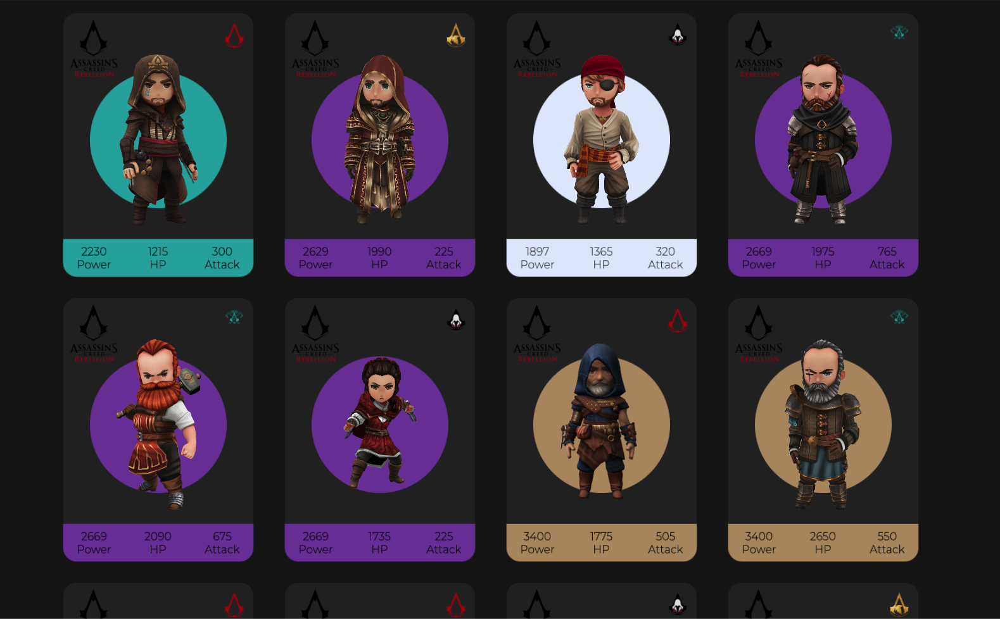

# ACR 3D Trading Cards

Assassin's Creed Rebellion 3D Trading Cards, created with HTML & CSS and using Vanilla Tilt library for the smooth 3D tilt.

The live demo for this application can be found here: [https://fromzerotocicero-acr-trading-cards.netlify.app/](https://fromzerotocicero-acr-trading-cards.netlify.app/)

## Description

A simple HTML and CSS project, that displays a concept for Assassin's Creed Rebellion Trading Cards. Each card has a smooth 3D parallax tilt effect, that showcases the assassins and their Power, HP and Attack stats at 5 stars, level 50, fully 5-star geared.

## License

This project is licensed under the MIT License - see the LICENSE.md file for details.

## Acknowledgments

Inspiration and code snippets have been used from:
* [Assassin's Creed Rebellion Official Website](https://www.ubisoft.com/en-us/game/assassins-creed/rebellion)
* [Online Tutorials - 3D Tilt cards](https://www.youtube.com/watch?v=W3pQXyjTKps&t=41s)
* [Clash of Clans RPG style cards](https://www.youtube.com/watch?v=OYZ03ahRx9Y&t=1s)